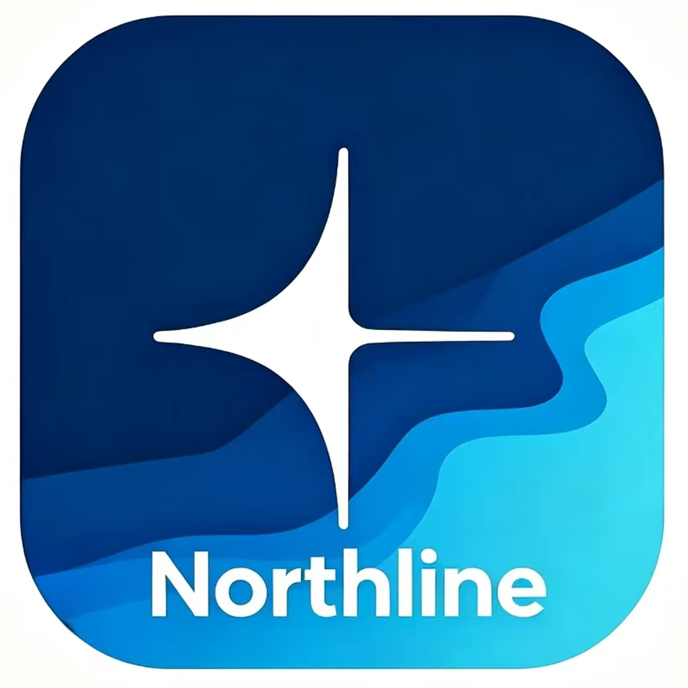
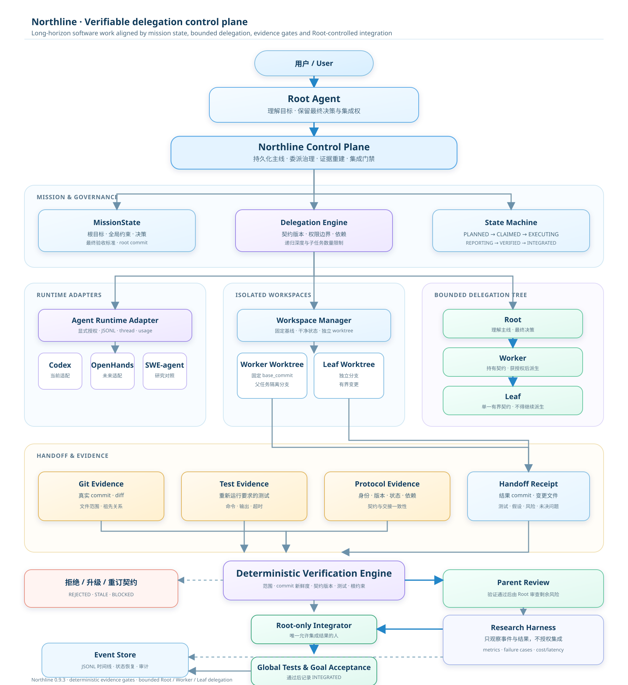

<p align="center">
  
</p>

<h1 align="center">Northline</h1>

<p align="center"><strong>让长程 Agent 工作始终沿着主线前进。</strong></p>

<p align="center">
  <a href="https://github.com/qll070226-a11y/northline/actions/workflows/ci.yml"></a>
  
  
  
  <a href="./LICENSE"></a>
</p>

Northline 是一个面向 Codex 的 Skill 与 Plugin，用持久化任务主线、版本化委派契约、结构化交接凭证和确定性验证门禁，减少长程软件开发中的目标漂移、范围越界、过期状态和无证据完成声明。

它不是另一个“让更多 Agent 同时写代码”的框架。Northline 是位于 Root Agent、执行运行时和 Git 仓库之间的控制层：Worker 和 Leaf 可以执行工作，但只有父侧重建证据并完成审查后，结果才有资格进入最终集成。

## 为什么需要 Northline

长程任务的风险往往不是某一步完全错误，而是连续调试后逐渐偏离最初目标：子任务忘记了范围，基于旧 commit 继续工作，声称测试通过却没有输出，或者修改了契约之外的文件。Northline 把这些风险转换成可以持久化、验证和审计的对象：

| 风险 | Northline 的控制点 |
| --- | --- |
| 目标漂移 | `MissionState` 保存根目标、全局约束和最终验收标准 |
| 委派失控 | `DelegationContract` 固定目标、依赖、允许文件、禁止文件和测试 |
| 交接失真 | `HandoffReceipt` 与父侧重新计算的 Git/Test 证据分开保存 |
| 状态过期 | 检查 `base_commit`、契约版本和 commit 祖先关系 |
| 范围越界 | 从 worktree 重新计算实际变更文件，拒绝超出契约的 diff |
| 错误合并 | `VERIFIED` 不等于 `INTEGRATED`，只有 Root 可以记录集成 |

## 总体架构



## 核心协议

### 委派树

默认结构是 `Root → Worker → Leaf`，最大递归深度为 2，单个父节点最多 4 个子任务。只有契约明确授权的 Worker 才能派生 Leaf；Leaf 不能修改根目标、全局约束或架构决策。

### 状态机

```text
PLANNED → CLAIMED → EXECUTING → REPORTING → VERIFIED → INTEGRATED
                         ├──────────────→ PARTIAL
                         ├──────────────→ BLOCKED
                         ├──────────────→ STALE
                         ├──────────────→ NEEDS_PARENT_DECISION
                         └──────────────→ REJECTED
```

`VERIFIED` 只表示交接凭证与独立证据通过门禁；它不代表代码已经合并。只有 Root 侧在父仓库复核 diff、运行全局测试并确认结果 commit 可达后，才可以记录 `INTEGRATED`。

### 关键对象

| 对象 | 作用 | 主要字段 |
| --- | --- | --- |
| `MissionState` | 保存根任务主线 | 目标、约束、决策、验收标准、根 commit |
| `ProtocolPolicy` | 保存治理策略 | 最大深度、并发规则、测试要求、超时、隔离策略 |
| `DelegationContract` | 定义一个有界子任务 | 目标、依赖、允许/禁止文件、测试、`base_commit`、版本 |
| `ExecutionState` | 记录当前执行状态 | agent、角色、worktree、状态历史、当前 commit |
| `HandoffReceipt` | 记录子智能体声明 | result commit、变更文件、测试、证据、假设、风险 |
| `RepositoryEvidence` | 父侧独立重建事实 | Git diff、祖先关系、文件范围、测试输出 |
| `AgentCheckpoint` | 支持中断恢复 | 已完成、待处理、阻塞、dirty files、观察到的 commit |
| `AgentRunRecord` | 保存运行轨迹 | thread、JSONL、usage、耗时、尝试次数、最终状态 |

## 验证门禁

父侧不会直接相信子智能体的“已完成”文字，而是重新检查：

1. agent 身份、契约 ID 和契约版本是否匹配；
2. `base_commit` 是否是当前有效基线，结果 commit 是否存在且基于该基线；
3. 实际 changed files 是否属于 `allowed_files`，是否触碰 `forbidden_files`；
4. required tests 是否由父契约指定，并在证据 worktree 中重新执行；
5. 测试输出、diff 摘要和交接凭证是否相互一致；
6. 是否违反 Root 的全局约束、依赖顺序或并发规则；
7. 合并后全局测试是否通过。

任何关键检查失败都会进入 `REJECTED`、`STALE`、`PARTIAL` 或 `NEEDS_PARENT_DECISION`，不能直接进入 `INTEGRATED`。LLM Judge 可以提供解释，但不能单独授权合并。

## 安装

### 安装完整 Plugin

```powershell
codex plugin marketplace add qll070226-a11y/northline --ref main
codex plugin add northline@northline
```

插件包含 Skill、MCP stdio 服务、协议核心、CLI、测试和研究材料。首次启动 MCP 服务时，会在插件目录创建 `.venv-plugin` 并安装运行依赖。也可以提前安装：

```powershell
git clone https://github.com/qll070226-a11y/northline.git
cd northline\plugins\northline
powershell -ExecutionPolicy Bypass -File scripts\setup_plugin.ps1
```

### 只安装 Skill

如果只需要流程规则和交接格式，可以不启用 MCP：

```powershell
git clone https://github.com/qll070226-a11y/northline.git
Copy-Item -Recurse -Force .\northline\plugins\northline\skills\northline "$env:USERPROFILE\.codex\skills\northline"
```

在 Codex 中调用：

```text
Use $northline to coordinate this implementation without losing the root objective.
```

## CLI 快速开始

在目标 Python/Git 仓库中初始化任务主线：

```powershell
northline init --workspace . `
  --objective "实现功能并保持原有 API" `
  --constraint "不得修改公开接口" `
  --criterion "测试全部通过"
```

创建一个有界子任务：

```powershell
northline contract --workspace . `
  --objective "实现解析器变更" `
  --in-scope "解析器行为" `
  --out-of-scope "公开 API 与数据库迁移" `
  --allowed-file "src/**/*.py" `
  --forbidden-file "pyproject.toml" `
  --criterion "解析器测试通过" `
  --test "pytest tests/test_parser.py"
```

准备隔离 worktree、派发任务并恢复状态：

```powershell
northline prepare --workspace . --contract-id contract_123 --target ..\northline-worktrees\contract_123
northline dispatch --workspace . --contract-id contract_123 > dispatch.json
northline resume --workspace .
```

完成后，Root 侧生成并验证交接凭证：

```powershell
northline receipt --workspace . --contract-id contract_123 `
  --summary "Implemented parser changes" `
  --acceptance-evidence "Parser tests pass=required parser tests passed" > receipt.json

northline verify --workspace . --contract-id contract_123 `
  --receipt receipt.json `
  --evidence-workspace ..\northline-worktrees\contract_123

# Root 审查通过后才执行：
northline integrate --workspace . --contract-id contract_123
northline report --workspace .
```

完整 MCP/CLI 流程见 [`product-workflow.md`](./plugins/northline/skills/northline/references/product-workflow.md)。

## MCP 工作流

Plugin 的 MCP 服务提供与 CLI 相同的控制面：

```text
health → schema/resume → initialize/migrate → draft contract
  → delegate → prepare worktree → dispatch or run Codex
  → checkpoint → reporting → draft receipt → verify
  → Root review → integrate → global tests → report
```

常用工具包括：

| 工具 | 用途 |
| --- | --- |
| `northline_health_check` | 检查插件、依赖、仓库和可选 Codex runtime，不自动调用模型 |
| `initialize_project` / `migrate_project` | 初始化或迁移 `.northline/` |
| `draft_project_contract` | 从 MissionState 和父 HEAD 生成版本化契约 |
| `delegate_project_task` | 保存契约并分配 Root/Worker/Leaf 角色 |
| `prepare_project_workspace` | 从契约基线创建隔离 worktree |
| `create_agent_task_packet` | 生成不依赖聊天记忆的完整任务包 |
| `record_agent_checkpoint` | 记录中断、阻塞和重试所需状态 |
| `verify_project_handoff` | 独立重算 Git/Test 证据，不集成代码 |
| `record_project_integration` | 确认父 HEAD、全局测试和最终集成 |
| `run_codex_project_agent` | 只有显式授权后才启动 Codex CLI，并保存 JSONL/usage |
| `get_project_resume` / `get_project_report` | 恢复主线、阻塞原因、委派树和协议开销 |

真实 Codex 运行默认先进行零模型调用预检。只有 Root 明确加入授权参数后，才会启动模型；运行失败会记录 `PARTIAL` 检查点，而不是留下虚假的 `RUNNING`。

## 持久化数据

所有协议状态都写入目标仓库的 `.northline/`，源代码仍由 Git 管理：

```text
.northline/
|-- project.json                 项目与 schema 版本
|-- mission.json                 根目标、约束、验收标准
|-- policy.json                  并发、隔离、测试和超时策略
|-- contracts/*.json             当前契约
|-- contract-history/*/v*.json  契约版本历史
|-- dispatches/*.json            Worker/Leaf 任务包
|-- checkpoints/<id>/*.json     中断恢复检查点
|-- agent-runs/*.json            Codex thread 与运行摘要
|-- run-artifacts/<run>/events.jsonl  原始事件轨迹
|-- receipts/*.json              子智能体交接凭证
|-- verifications/*.json         父侧验证结果
|-- escalations/*.json           升级请求
|-- decisions/*.json             Root/用户决定
|-- integrations/*.json          集成事实
`-- events.jsonl                 append-only 审计时间线
```

验证阶段只写协议证据，不修改源文件。集成是 Root 的显式动作。

## 项目结构

```text
.agents/plugins/marketplace.json    GitHub marketplace 入口
plugins/northline/
|-- .codex-plugin/plugin.json       Plugin manifest
|-- .mcp.json                       stdio MCP 配置
|-- skills/northline/               Skill、角色和参考流程
|-- src/northline/                  协议核心、状态机、验证器、CLI、MCP
|-- tests/                          产品和研究基础设施测试
|-- experiments/                    任务、故障注入、评估和统计分析
`-- docs/                           架构、论文、预注册和复现说明
```

## 参考的开源项目

Northline 借鉴了开源 Agent 系统的执行经验，但没有把这些运行时混在协议核心里。这样可以保持实验可比性，也能在未来替换运行时而不改变验证规则。

| 项目 | GitHub | 借鉴内容 | Northline 中的边界 |
| --- | --- | --- | --- |
| LangGraph | [langchain-ai/langgraph](https://github.com/langchain-ai/langgraph) | 持久化状态图、节点和恢复 | 作为可选编排适配器；协议真相仍在 `ProtocolEngine` |
| OpenHands | [All-Hands-AI/OpenHands](https://github.com/All-Hands-AI/OpenHands) | 软件工程 Agent 执行环境、工具交互和工作区思路 | 不直接嵌入；未来可作为 runtime adapter |
| SWE-agent | [SWE-agent/SWE-agent](https://github.com/SWE-agent/SWE-agent) | 仓库级任务、Git 修改和 SWE-bench 评估方式 | 借鉴仓库任务与评估接口；Northline 负责契约和证据门禁 |
| MetaGPT | [FoundationAgents/MetaGPT](https://github.com/FoundationAgents/MetaGPT) | 角色分工、软件工程流程和产物交接 | 采用 Root/Worker/Leaf 的受控角色边界，不复制其调度实现 |
| ChatDev | [OpenBMB/ChatDev](https://github.com/OpenBMB/ChatDev) | 多角色对话协作和阶段性交接 | 将自然语言交接扩展为带 commit、diff、测试和风险的 `HandoffReceipt` |
| Microsoft Agent Framework | [microsoft/agent-framework](https://github.com/microsoft/agent-framework) | 后续标准化多智能体运行时的方向 | 作为未来跨运行时适配和互操作研究参考 |

Northline 当前选择“一个运行时 + 一个独立协议核心”：LangGraph 负责可选流程编排，协议核心负责契约、状态、证据、验证和集成权限。

## 测试与复现

在仓库根目录执行：

```powershell
cd plugins\northline
powershell -ExecutionPolicy Bypass -File scripts\setup.ps1
..\..\.venv-win\Scripts\python.exe -m pytest tests -q
..\..\.venv-win\Scripts\ruff.exe check src tests
..\..\.venv-win\Scripts\python.exe -m northline.cli forward-test --output ..\..\results\product-forward-test.json
```

`forward-test` 使用全新的临时 Git 仓库验证成功、递归委派、范围越界、过期基线、失败恢复和清理路径，不产生真实模型调用。它证明的是协议和产品接线，不等同于模型能力评估。

真实任务测试分为两步：

```powershell
# 1. 零模型调用预检
northline live-forward-test --workspace . --contract-id CONTRACT_ID `
  --output results\live-forward-test.json

# 2. 只有 Root 明确授权后才启动 Codex
northline live-forward-test --workspace . --contract-id CONTRACT_ID `
  --authorize --output results\live-forward-test-authorized.json
```

## 研究材料

仓库附带英文论文草稿、文献矩阵、预注册、受控任务、合成故障注入和统计分析代码。研究问题集中在：

- 受控递归委派是否降低目标漂移率；
- 契约、交接凭证、父验收和 worktree 隔离分别贡献多少；
- 哪些状态类和范围类错误能被确定性规则提前拦截；
- 递归深度、验证强度、成本和延迟之间的关系。

研究指标包括根目标满足率、范围越界率、过期状态接受率、证据不足率、错误合并率、测试通过率、token、延迟、重试和人工介入次数。论文材料位于 [`plugins/northline/docs`](./plugins/northline/docs)，但产品 Skill/Plugin 是当前首要交付物。

## 当前边界

- 当前支持目标为 Python/Git 仓库。
- 最大递归深度固定为 2，避免无界委派扩大漂移和成本。
- Root 必须保留最终集成权；Northline 不自动替 Root 合并代码。
- 语义目标是否真正满足仍需要 Root 审查，确定性门禁主要覆盖状态、范围、身份、依赖和证据。
- 多机分布式调度、在线训练、完整 UI 和跨语言仓库不在当前版本范围内。
- Codex provider 的可达性由运行环境决定；Northline 会把连接失败记录为 `PARTIAL`，不会伪造成功。

## 开发

```powershell
cd plugins\northline
powershell -ExecutionPolicy Bypass -File scripts\setup.ps1
..\..\.venv-win\Scripts\python.exe -m pytest tests -q
..\..\.venv-win\Scripts\ruff.exe check src tests
powershell -ExecutionPolicy Bypass -File scripts\package_plugin.ps1
powershell -ExecutionPolicy Bypass -File scripts\package_skill.ps1
```

提交前请确认：协议 schema 有自动校验、forward suite 通过、插件 manifest 有效、README 中的命令与当前 CLI 一致，并且没有将 API key 或运行时私密日志提交到仓库。

## License

[MIT](./LICENSE)
