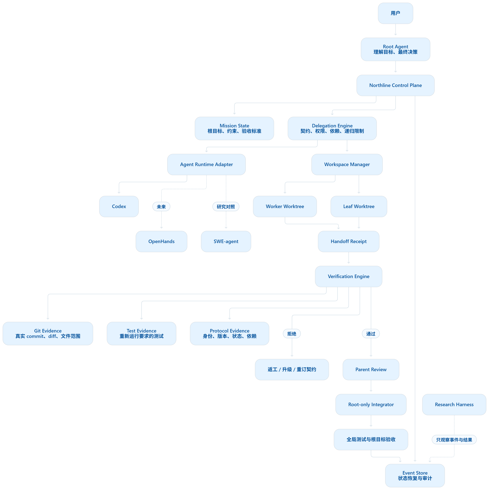

<p align="center">
  
</p>

<h1 align="center">Northline</h1>

<p align="center"><strong>让长程 Agent 工作始终沿着主线前进。</strong></p>

<p align="center">
  <a href="https://github.com/qll070226-a11y/northline/actions/workflows/ci.yml"></a>
  
  
  <a href="./LICENSE"></a>
</p>

Northline 是一个面向 Codex 的 Skill 与 Plugin，用持久化任务主线、版本化委派契约、结构化交接凭证和确定性验证门禁，减少长程软件开发中的目标漂移、范围越界、过期状态和无证据完成声明。

它不是另一个自动合并代码的多智能体框架。Northline 是独立于编排框架的控制层：子智能体可以执行工作，但只有父智能体完成证据检查后，结果才有资格进入最终集成审查。

## 工作方式



Northline 默认采用受约束的 `Root -> Worker -> Leaf` 委派树，最大深度为 2。每次交接都必须关联当前契约版本、基线 commit、实际变更文件、测试结果和验收证据。

## 核心能力

| 能力 | Northline 的约束 |
| --- | --- |
| 主线持久化 | 将目标、约束、决策和验收标准保存到仓库内 `.northline/` |
| 递归委派 | 只有获授权的 Worker 可以继续派生 Leaf，Root 保留最终集成权 |
| 范围控制 | 对允许文件、禁止文件、局部目标和依赖进行确定性检查 |
| 状态新鲜度 | 阻止基于过期 commit 或旧契约版本提交的结果 |
| 证据门禁 | 父侧重建 Git diff、祖先关系和测试结果，不信任子智能体的完成声明 |
| 并发审查 | 文件无重叠仍不够，共享 API、schema、迁移或顺序依赖也会阻止并行 |
| 可追溯性 | 事件日志能够还原委派树、状态转换、验证结果与阻断原因 |
| 安全集成 | `VERIFIED` 只授权审查；Root 合并并复测后才记录 `INTEGRATED` |

## 安装 Plugin

Codex CLI 支持直接添加 GitHub marketplace：

```powershell
codex plugin marketplace add qll070226-a11y/northline --ref main
codex plugin add northline@northline
```

首次启动 MCP 服务时，插件会在自身目录创建 `.venv-plugin` 并安装运行依赖。也可以提前手动完成：

```powershell
git clone https://github.com/qll070226-a11y/northline.git
cd northline\plugins\northline
powershell -ExecutionPolicy Bypass -File scripts\setup_plugin.ps1
```

根据 [OpenAI Docs](https://learn.chatgpt.com/docs/build-plugins)，Plugin 可以组合 Skill、MCP 服务和可选 UI；Northline 当前提供 Skill 与本地 stdio MCP 服务。

## 仅安装 Skill

不需要 MCP 工具时，可以只安装轻量 Skill：

```powershell
git clone https://github.com/qll070226-a11y/northline.git
Copy-Item -Recurse -Force .\northline\plugins\northline\skills\northline "$env:USERPROFILE\.codex\skills\northline"
```

在 Codex 中显式调用：

```text
Use $northline to coordinate this implementation without losing the root objective.
```

## CLI 快速开始

初始化任务主线：

```powershell
northline init --workspace . `
  --objective "实现功能并保持原有 API" `
  --constraint "不得修改公开接口" `
  --criterion "测试全部通过"
```

创建子任务契约并恢复状态：

```powershell
northline contract --workspace . `
  --objective "实现解析器变更" `
  --in-scope "解析器行为" `
  --allowed-file "src/**/*.py" `
  --criterion "解析器测试通过" `
  --test "pytest tests/test_parser.py"

northline status --workspace .
```

完整交接流程见 [product-workflow.md](./plugins/northline/skills/northline/references/product-workflow.md)。
完整系统边界、数据流和信任模型见 [architecture.md](./plugins/northline/docs/architecture.md)。

## MCP 工具

| 工具 | 用途 |
| --- | --- |
| `initialize_project` | 初始化仓库级 MissionState |
| `get_project_status` | 恢复当前任务主线和阻断状态 |
| `get_project_resume` | 返回委派树、过期状态、阻断原因和推荐动作 |
| `draft_project_contract` | 自动填充 mission、父 HEAD、版本和契约 ID |
| `delegate_project_task` | 保存契约并分配有界 Worker/Leaf 执行 |
| `prepare_project_workspace` | 在契约基线创建隔离 Git worktree |
| `transition_project_handoff` | 持久化合法状态转换 |
| `check_parallel_safety` | 保守评估两个子任务能否并行 |
| `validate_handoff` | 无状态预检 HandoffReceipt |
| `check_transition` | 验证协议状态转换是否合法 |
| `verify_project_handoff` | 重建 Git/测试证据并记录交接，不集成代码 |
| `draft_project_receipt` | 从分配 worktree 生成真实 commit、diff 和测试字段 |
| `record_project_integration` | 确认父 HEAD 包含结果并复测后记录集成 |
| `submit_project_escalation` | 保存停止工作的升级请求 |
| `decide_project_escalation` | 保存 Root/用户对升级请求的决定 |
| `revise_project_contract` | 安装获批的新契约版本并重新开始 |

## 持久化布局

```text
.northline/
|-- mission.json
|-- policy.json
|-- contracts/*.json
|-- contract-history/*/v*.json
|-- executions/*.json
|-- receipts/*.json
|-- verifications/*.json
|-- escalations/*.json
|-- decisions/*.json
|-- integrations/*.json
`-- events.jsonl
```

## 项目结构

```text
.agents/plugins/marketplace.json    Codex marketplace 入口
plugins/northline/
|-- .codex-plugin/plugin.json       Plugin manifest
|-- .mcp.json                       stdio MCP 配置
|-- skills/northline/               Skill 指令和 UI 元数据
|-- src/northline/                  协议核心、验证器、CLI 与 MCP 服务
|-- tests/                          产品与研究基础设施测试
|-- experiments/                    可复现实验和统计分析
`-- docs/                           论文草稿、预注册与研究记录
```

## 开发与验证

```powershell
cd plugins\northline
powershell -ExecutionPolicy Bypass -File scripts\setup.ps1
.\.venv-win\Scripts\python.exe -m pytest -q
.\.venv-win\Scripts\ruff.exe check .
powershell -ExecutionPolicy Bypass -File scripts\package_plugin.ps1
```

当前测试覆盖协议 schema、状态机、范围检查、过期状态、错误 agent、测试证据、工作区隔离、MCP stdio、跨进程恢复、实验冻结和统计分析。研究材料是辅助交付，产品 Skill 与 Plugin 是当前主线。

## 设计边界

- Northline 不把 LLM Judge 当作合并授权者。
- `VERIFIED` 表示交接证据通过门禁，不等于代码已经集成。
- 任何关键 `BLOCK` 发现都必须修订契约、重新执行或升级给父智能体。
- 修改 Root 全局约束需要显式用户批准。
- v1 固定最大递归深度为 2，避免无界委派扩大漂移和成本。

## 研究

仓库附带英文论文草稿、文献矩阵、预注册、合成故障注入和实验分析代码。研究目标是测量 Northline 对目标漂移率、范围越界率、过期状态接受率、无证据完成声明率、错误合并率、成本和延迟的影响，而不是以主观稳定感替代证据。

## License

[MIT](./LICENSE)
